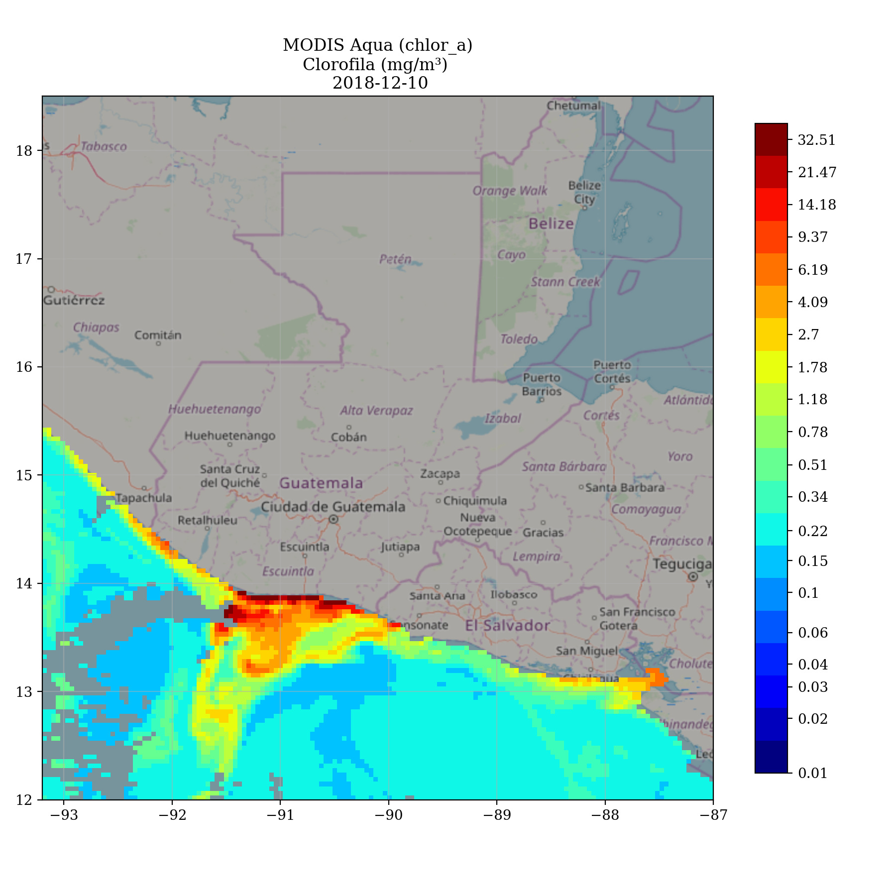

# Detección de FAN con imágenes satelitales   

Como parte de mi proyecto de prácticas finales de la licenciatura en Física, estoy trabajando para el INSIVUMEH en un producto de detección remota de floarciones algales nocivas (FAN).


## Producto

Construir la imagen de docker:

```
cd producto-docker/run-environment
docker build -t geopy-1 .
```

Correr el producto:
```
docker run -it --rm -v `pwd`/producto:/app -v `pwd`/output:/output -e DATE=2018-12-10 geopy-1 python3 /app/fan_gt.py
```

Esta imagen es del 10 de Diciembre del 2018. Se pensó que hubo una FAN ese día en la costa sur, aunque no se tienen datos biológicos que lo confirmen ya que la concentración de clorofila no siempre indica la presencia de una FAN.


